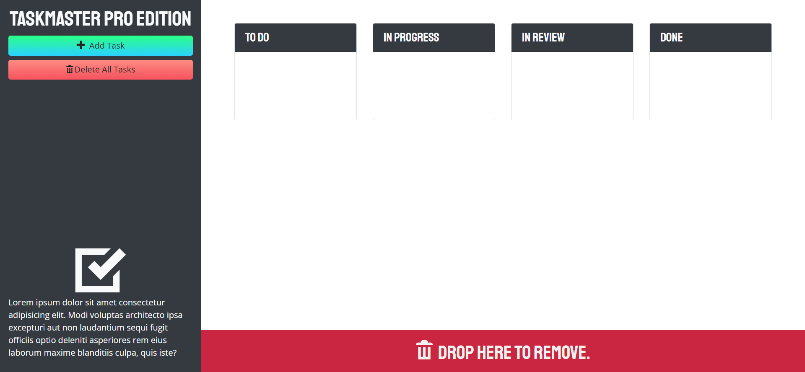

# taskmaster-pro

  ## Description

  Provide a short description explaining the what, why, and how of your project. Use the following questions as a guide:
  
  - What was my motivation? I wanted to create a task management application that I could use in the future for personal use.
  - Why did I build this project? I wanted to expand upon the skills I learned from building the Taskinator application.
  - What problem does it solve? It solves the issue of users needing a task management application that can store their tasks locally regardless of date.
  - What did I learn? I learned how to utilize HTML, CSS, JavaScript, and jQuery to create a task management application.
  - What makes my project stand out? My project has a very clean user interface and is easy to use.
  
  
  ## Table of Contents (Optional)
  
  - [Description](#description)
  - [Credits](#credits)
  - [License](#license)
  - [Features](#features)

  ## Installation

  What are the steps required to install your project? Provide a step-by-step description of how to get the development environment running.

  ## Usage

  Provide instructions and examples for use. Include screenshots as needed.
  
  To add a screenshot, create an assets/images folder in your repository and upload your screenshot to it. Then, using the relative filepath, add it to your README using the following syntax:

  md
  
  
  ## Credits

  None.
  ## License

  No license.

  ---

  ## Features
  
  If your project has a lot of features, list them here.

  ## How to Contribute

  If you created an application or package and would like other developers to contribute it, you can include guidelines for how to do so. The [Contributor Covenant](https://www.contributor-covenant.org/) is an industry standard, but you can always write your own if you'd prefer.

  ## Questions?
  If you have any questions, check out my [GitHub profile](https://github.com/zachary-levin) at or email me at [zlevin706@gmail.com](mailto:zlevin706@gmail.com)
